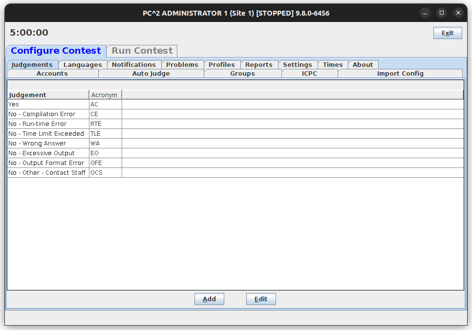

- [Sistemas de apoio a competições de programação alternativos ao BOCA \& Maratona Linux](#sistemas-de-apoio-a-competições-de-programação-alternativos-ao-boca--maratona-linux)
  - [Alternativas](#alternativas)
    - [Plataformas online](#plataformas-online)
    - [Contest Management System (CMS)](#contest-management-system-cms)
    - [PC²](#pc)
    - [DOMjudge](#domjudge)
  - [Referencias bibliográficas](#referencias-bibliográficas)

# Sistemas de apoio a competições de programação alternativos ao BOCA & Maratona Linux

A exploração de alternativas em sistemas de apoio a competições de programação se justifica pois possibilita uma compreensão mais aprofundada dos desafios e soluções já implementadas por outros desenvolvedores nesse domínio.

## Alternativas

### Plataformas online

Existem várias plataformas online dedicadas à programação competitiva. Entre as mais populares, destaca-se: [Beecrowd](https://www.beecrowd.com.br), [CodeChef](https://www.codechef.com/), [LeetCode](https://leetcode.com/) e [Online Judge](https://onlinejudge.org/). A característica central dessas ferramentas é a disponibilização de um extenso banco de dados de problemas e a capacidade de autocorreção de submissões. Isso torna essas plataformas um recurso extremamente valioso no treinamento para competições de programação. No entanto, essas plataformas não oferecem uma solução completa para a organização de maratonas. Nem mesmo plataformas como a Beecrowd e CodeChef que possuem a capacidade de hospedar competições criadas por usuários [fonte](https://www.beecrowd.com.br/judge/pt/faqs/about/contests) [fonte](https://www.codechef.com/hostyourcontest), oferecem uma solução nativa para isolar o ambiente das máquinas dos competidores. Isso certamente está relacionado às limitações de uma aplicação web. A fim de assegurar a integridade de competições realizadas nessas plataformas, seria necessário a utilização de ferramentas de terceiros. Isso não é ideal pois aumentaria a complexidade da organização de uma maratona, o que é justamente o que se está tentando evitar ao explorar alternativas ao BOCA e Maratona Linux.

### Contest Management System (CMS)

O Contest Management System (CMS) foi criado em 2012 para ser usado na Olimpíada Internacional de Informática de 2012. Desde então, tem sido utilizado em todas as edições dessa competição (exceto a edição de 2016) e em competições de programação similares [fonte](https://cms-dev.github.io/testimonials.html) [fonte, pág. 3](https://www.researchgate.net/profile/Jamaladdin-Hasanov/publication/352454191_On_Using_Real-Time_and_Post-Contest_Data_to_Improve_the_Contest_Organization_TechnicalScientific_Procedures_and_Build_an_Efficient_Contestant_Preparation_Strategy/links/60ccc296a6fdcc01d482aab7/On-Using-Real-Time-and-Post-Contest-Data-to-Improve-the-Contest-Organization-Technical-Scientific-Procedures-and-Build-an-Efficient-Contestant-Preparation-Strategy.pdf) [fonte](https://github.com/ioi-2022/cms) [fonte](https://github.com/ioi-2023/cms).

O CMS é um projeto open-source, desenvolvido em Python e que usa PostgreSQL como banco de dados. De modo geral, é um sistema bastante semelhante ao BOCA que oferece basicamente o mesmo conjunto de funcionalidades. Entre elas: cadastro de competições, equipes e problemas, submissão de soluções, autocorreção de submissões e acompanhamento do placar em tempo-real. O acesso é feito através do navegador e o sistema é dividido em área do competidor e área do administrador. Destaca-se que o provisionamento do servidor é de responsabilidade dos organizadores do evento. Durante a competição, as equipes devem utilizar como sistema operacional uma versão modificada do Linux Ubuntu que uniformiza o ambiente das máquinas dos competidores e implementa medidas anti-fraude [fonte](https://github.com/ioi-2023/contestant-vm). Esse sistema operacional modificado desempenha a mesma função do Maratona Linux. O CMS possui algumas vantagens pertinentes em relação ao BOCA: sistema mais moderno, atualizações mais frequentes e documentação de melhor qualidade. Por outro lado, a falta de documentação em português é um empecilho para a adoção desse sistema em competições brasileiras. Além disso, o CMS compartilha de uma das principais desvantagens identificadas no BOCA — a complexidade na instalação e configuração do sistema devido a necessidade de provisionar um servidor e de instalar um sistema operacional modificado nas máquinas dos competidores.

*CMS - página de overview do painel do administrador.*
  

*CMS - página de problema do painel do competidor.*
  

*CMS - página de submissão do painel do competidor.*
  

### PC²

PC² (the Programming Contest Control system) é um software open-source de apoio a competições de programação desenvolvido pela Universidade Estadual de Sacramento. Foi utilizado nas finais mundiais do ICPC (International Collegiate Programming Contest) entre 1994 e 2009 e continua sendo usado em regionais do ICPC e em outras competições do mesmo formato [fonte](https://en.wikipedia.org/wiki/PC%C2%B2).

O PC² possui um conjunto de funcionalidades muito semelhantes ao BOCA e CMS. Uma diferença notável é que PC² é um aplicativo de desktop desenvolvido em Java. É compatível com Windows, MacOS e várias distribuições Linux. Para executar o PC2, é necessário realizar o download de um arquivo compactado que contém vários executáveis. Existem executáveis específicos para administradores e competidores, além de um executável denominado "server" que possibilita a comunicação entre os diversos clientes. Apesar de não possuir uma interface moderna, o PC² recebe atualizações regulares e possui documentação abrangente e atualizada (no entanto, não há versão em português). Por outro lado, não possui a capacidade de isolar o ambiente das máquinas dos competidores.

*PC² Server*
  

*PC² Admin*
  

*PC² Team*
  

### DOMjudge

DOMjudge é um sistema de apoio à competições de programação. Tem sido utilizado nas finais mundiais do ICPC desde 2018, dentre outras competições similares [fonte](https://www.domjudge.org/about). 

O DOMjudge é um projeto open-source, desenvolvido em PHP e que usa MySQL como banco de dados. Tal como outras alternativas citadas anteriormente, possui um conjunto de funcionalidades muito similar ao do BOCA. Também compartilha com o BOCA a necessidade de provisionar um servidor e da utilização de um sistema operacional modificado nas máquinas dos competidores. As finais do ICPC, por exemplo, utilizam uma versão modificada do Ubuntu [fonte](https://docs.icpc.global/worldfinals-programming-environment/). O ponto de distinção mais notável do DOMjudge é a sua interface moderna que proporciona uma experiência de uso muito mais agradável do que as outra soluções analisadas. Uma demo está disponível [nesse link](https://www.domjudge.org/demo). Além disso, o projeto também possui uma documentação abrangente e atualizada (porém, não há versão em português).

*DOMjudge - página inicial do administrador.*
  

*DOMjudge - página inicial da equipe.*
  

*DOMjudge - página pública do placar.*
  

## Referencias bibliográficas

- Maggiolo, S. and Mascellani, G. **Introducing CMS: A Contest Management System**, 2012. Olympiads in Informatics, 6. Disponível em: https://ricerca.sns.it/bitstream/11384/12473/1/INFOL107-1.pdf.

- **CMS (Contest Management System)**, 2023. Disponível em: https://github.com/cms-dev/cms.

- **PC² (the Programming Contest Control)**, 2023. Disponível em: https://pc2ccs.github.io/.

- **PC² - Contest Administrator’s Installation and Configuration Guide**, 2023. Disponível em: https://pc2ccs.github.io/docs/pc2v9AdminGuide.pdf.

- **DOMjudge**, 2023. Disponível em: https://www.domjudge.org/.
