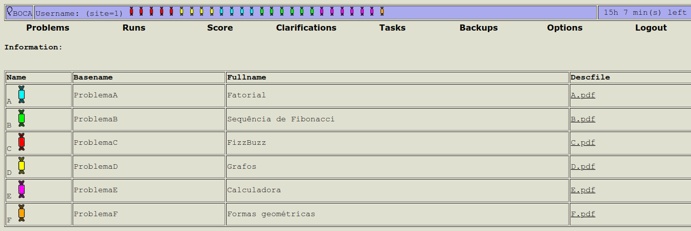

- [Instalação e configuração do BOCA e Maratona Linux](#instalação-e-configuração-do-boca-e-maratona-linux)
  - [Instalação do BOCA](#instalação-do-boca)
    - [Instalação local](#instalação-local)
      - [Instalação de todos os componentes em uma mesma máquina](#instalação-de-todos-os-componentes-em-uma-mesma-máquina)
      - [Instalação dos componentes em máquinas diferentes](#instalação-dos-componentes-em-máquinas-diferentes)
      - [boca-docker no Windows](#boca-docker-no-windows)
    - [Instalação na nuvem](#instalação-na-nuvem)
    - [Acessar BOCA](#acessar-boca)
  - [Instalação do Maratona Linux](#instalação-do-maratona-linux)
    - [Instalação em máquina física](#instalação-em-máquina-física)
    - [Instalação em máquina virtual](#instalação-em-máquina-virtual)
  - [Permitir a conexão entre uma instância do BOCA e o Maratona Linux](#permitir-a-conexão-entre-uma-instância-do-boca-e-o-maratona-linux)
  - [Configurações e orientações adicionais](#configurações-e-orientações-adicionais)
    - [Permitir alteração do papel de parede no Maratona Linux](#permitir-alteração-do-papel-de-parede-no-maratona-linux)
    - [Configuração otimizada do Maratona Linux em máquina virtual](#configuração-otimizada-do-maratona-linux-em-máquina-virtual)
    - [Permitir momentaneamente acesso à internet no Maratona Linux](#permitir-momentaneamente-acesso-à-internet-no-maratona-linux)
    - [Habilitar pastas compartilhadas no VirtualBox](#habilitar-pastas-compartilhadas-no-virtualbox)
    - [Alterar layout do teclado no Ubuntu Server](#alterar-layout-do-teclado-no-ubuntu-server)
    - [Alterar o fuso horário no Ubuntu Server](#alterar-o-fuso-horário-no-ubuntu-server)
    - [Adicionar domínio ao servidor do BOCA](#adicionar-domínio-ao-servidor-do-boca)
      - [Ativar certificado SSL para o domínio](#ativar-certificado-ssl-para-o-domínio)
    - [Instalar um desktop environment (GUI) no Ubuntu Server](#instalar-um-desktop-environment-gui-no-ubuntu-server)
    - [Ocultar o menu GRUB](#ocultar-o-menu-grub)
    - [Conectar com o banco de dados do BOCA usando o pgAdmin](#conectar-com-o-banco-de-dados-do-boca-usando-o-pgadmin)
    - [Instalar Adminer no servidor do BOCA](#instalar-adminer-no-servidor-do-boca)
    - [Remover o ícone do Mozilla Firefox do Maratona Linux](#remover-o-ícone-do-mozilla-firefox-do-maratona-linux)
    - [Habilitar compartilhamento de rede no Windows 11](#habilitar-compartilhamento-de-rede-no-windows-11)
    - [Substituir o indicador visual de problemas do BOCA](#substituir-o-indicador-visual-de-problemas-do-boca)
    - [Aceitar submissões em JavaScript no BOCA](#aceitar-submissões-em-javascript-no-boca)
    - [Cadastrar usuários em batch](#cadastrar-usuários-em-batch)
    - [Manter o processo do `boca-autojudge` em execução no servidor BOCA](#manter-o-processo-do-boca-autojudge-em-execução-no-servidor-boca)
    - [Limpar a pasta pessoal do usuário ICPC no Maratona Linux](#limpar-a-pasta-pessoal-do-usuário-icpc-no-maratona-linux)
    - [O basename dos problemas deve ter no mínimo 3 caracteres](#o-basename-dos-problemas-deve-ter-no-mínimo-3-caracteres)
    - [Como lidar com diferentes padrões de quebra de linhas em arquivos de output](#como-lidar-com-diferentes-padrões-de-quebra-de-linhas-em-arquivos-de-output)
    - [Alterar a senha do banco de dados do BOCA](#alterar-a-senha-do-banco-de-dados-do-boca)
    - [Deletar uma equipe](#deletar-uma-equipe)
  - [Checklists](#checklists)
    - [BOCA (hospedado na nuvem)](#boca-hospedado-na-nuvem)
    - [Maratona Linux (em máquina virtual)](#maratona-linux-em-máquina-virtual)

</br>

# Instalação e configuração do BOCA e Maratona Linux

BOCA (BOCA Online Contest Administrator) e Maratona Linux são dois sistemas gratuitos e de código aberto amplamente adotados para auxiliar na realização de competições de programação. Embora compartilhem extensivamente do mesmo grupo de mantedores, são dois projetos distintos que podem ser utilizados separadamente. No entanto, são comumente empregados em conjunto devido ao fato de possuírem funcionalidades complementares.<sup>[fonte, 4:53 - 5:57](https://youtu.be/Hp-bL2Ws8M8?feature=shared&t=293)</sup>

Essas ferramentas são utilizadas em conjunto nas competições latino-americanas que funcionam como classificatórias para a competição mundial de programação do ICPC (International Collegiate Programming Contest). Isso inclui ambas as fases da Maratona de Programação da SBC (Sociedade Brasileira de Computação).<sup>[fonte, 0:00 - 3:30](https://www.youtube.com/watch?v=Hp-bL2Ws8M8)</sup> É relevante ressaltar que o ICPC, por outro lado, utiliza ferramentas próprias<sup>[fonte](https://tools.icpc.global/)</sup>. Ademais, o BOCA e o Maratona Linux são frequentemente utilizadas em competições que não possuem filiação com a SBC. Isso ocorre pois esses são sistemas robustos que já estão sendo utilizados há anos em eventos de larga escala e também como forma de preparação para caso algum competidor eventualmente participe de uma competição oficial da SBC.

Conforme dito anteriormente, o BOCA e o Maratona Linux possuem funcionalidades distintas e complementares. O BOCA é uma sistema desenvolvido em PHP e PostgreSQL acessível através de um navegador. Em suma, os organizadores de competições utilizam o BOCA para cadastrar equipes e problemas, avaliar submissões e responder dúvidas e os competidores utilizam o BOCA para visualizar os problemas, submeter soluções e acompanhar as correções. Por outro lado, o Maratona Linux é um versão modificada do Linux Ubuntu que possui um conjunto de ferramentas (compiladores, editores de texto, etc.) pré-instaladas para auxiliar os competidores durante a maratona. Além disso, o Maratona Linux possui um conjunto de configurações que visam impedir o acesso à internet e a conexão com dispositivo de mídia física (como pendrives e partições diferente daquela que está sendo usada pelo próprio Maratona Linux).

Resumidamente, a configuração da infraestrutura necessária para conduzir uma maratona de programação com a utilização do BOCA e do Maratona Linux é dividida nas seguinte etapas: instalação do BOCA em um servidor, instalação do Maratona Linux nos computadores que serão utilizados pelas equipes competidoras e configuração da conexão entre o BOCA e o Maratona Linux. Entretanto, há diferentes formas de instalar o BOCA e o Maratona Linux e a seleção da alternativa mais adequada deve ser fundamenta nas particularidades de cada competição, tais como a quantidade de equipes participantes e o conhecimento técnico dos técnicos de laboratório. A seguir são apresentadas as instruções para os métodos mais comuns de instalação do BOCA e do Maratona Linux.

É relevante mencionar que esse tutorial foi elaborado com base nas seguintes versões:

- Ubuntu Desktop 22.04.3;
- Ubuntu Server 22.04.3;
- maratona-desktop 20230227;
- BOCA 1.5.19-1.

## Instalação do BOCA

É possível instalar o BOCA em um computador local ou na nuvem. Os fatores a serem considerados para a escolha entre essas duas opções são:

- Nível de experiência dos técnicos de laboratório com a hospedagem em nuvem: a instalação local é mais simples pois não demanda conhecimento de hospedagem em nuvem. No entanto, ressalta-se que alguns provedores de nuvem são de fácil utilização e possuem baixo custo.
- Quantidade de equipes participantes: a instalação na nuvem é mais adequada para competições com um grande número de equipes participantes pois é possível escalar a infraestrutura de acordo com a demanda.
- Localização dos participantes: a instalação local é adequada somente para competições centralizadas em que todos os participantes estarão presentes em um mesmo local utilizando computadores conectados a uma mesma rede.
- Disponibilidade de internet: quando o BOCA está instalado localmente não é necessário possuir acesso à internet durante o evento. Isso é vantajoso, pois falhas na internet não irão interferir no andamento da competição.

A instalação e utilização do BOCA quando instalado na nuvem é praticamente idêntica ao BOCA instalado localmente. Para o administrador do BOCA, a principal diferença é que o SSH (Secure Shell Protocol) será utilizado para realizar o login remoto na máquina do provedor de nuvem ao invés de acessar o terminal diretamente da máquina em que o sistema está instalado tal como ocorre em uma instalação local. Enquanto que para os usuários (organizadores e competidores) a única diferença perceptível é que o BOCA hospedado na nuvem é acessado através de um endereço IP público e não através de um endereço IP local.

O provedor de nuvem escolhido para demostrar como é feito a instalação do BOCA na nuvem foi o DigitalOcean devido à sua facilidade de uso e preço acessível. No entanto, é importante ressaltar que o BOCA na sua versão atual pode ser instalado em qualquer provedor de nuvem em que é possível instalar o sistema operacional Ubuntu Server 22.04.

Outra decisão há ser tomada antes de prosseguir com a instalação está relacionada a como organizar os diferentes componentes do BOCA. O BOCA é composto por três componentes: servidor web, banco de dados e autojudge. Esses componentes podem ser instalados em uma mesma máquina ou em máquinas distintas. A instalação dos componentes em máquinas diferentes é recomendada para que o consumo de recursos por parte de um componente não interfira no desempenho de um outro componente. No entanto, a instalação de todos os componentes em uma mesma máquina é perfeitamente razoável para competições de pequeno porte. Por fim, há também a opção de utilizar o boca-docker que é um projeto que visa facilitar a instalação do BOCA através da utilização de containers Docker. Isso torna possível usufruir das vantagens proporcionadas pelo Docker, como: portabilidade (isso é, possibilita instalação do BOCA em outros sistemas operacionais além do Ubuntu), modularidade e escalabilidade. Essa é uma boa alternativa para técnicos de laboratório que já possuem experiência na utilização do Docker.

### Instalação local

Utilizaremos máquinas virtuais para demostrar como é feita a instalação local do BOCA. Essa é uma alternativa mais eficiente, pois a criação, clonagem e exclusão de sistemas operacionais são procedimentos mais ágeis de serem realizados em máquinas virtuais do que em máquinas físicas. O processo de instalação em bare metal é praticamente idêntico à instalação em uma máquina virtual, com a exceção das etapas iniciais que incluem a criação de um pendrive bootável e a configuração do particionamento do disco rígido, ao invés da configuração de software de virtualização e definição de especificações da máquina virtual. Ademais, a seção [Instalação do Maratona Linux](#instalação-do-maratona-linux) contém uma discussão mais detalhada acerca das vantagens e desvantagens da instalação do Maratona Linux em máquina física em comparação com a instalação em máquina virtual que pode ser generalizada para a instalação do BOCA.

1. Faça o download da última versão do [Ubuntu Server 22.04](https://ubuntu.com/download/server).
2. Faça o download e instale o [VirtualBox](https://www.virtualbox.org/wiki/Downloads).
    - Caso você receba algum erro durante a instalação do VirtualBox solicitando que você instale o VirtualBox Extension Pack, lembre-se de fazer o download do extension pack da mesma versão do VirtualBox. O download do extension pack se encontra na mesma página do link acima.
3. Abra o VirtualBox e crie uma nova máquina virtual com as seguintes especificações:
    - Nome: `boca`;
    - Tipo: `Linux`;
    - Versão: `Ubuntu 22.04 LTS (Jammy Jellyfish) (64-bit)`;
    - Memória Base: `4096MB`;
    - Processadores: `4`;
    - Tamanho do disco: `15GB`.
4. Nas configurações da máquina recém-criada, performe as seguintes modificações:
    1. Na aba de Armazenamento, adicione como `Dispositivo IDE Secundário 0` a image ISO baixada na etapa 1.
    2. Na aba de Rede, mude o tipo de conexão da placa de rede de `Nat` para `Placa em modo Bridge` para que a máquina virtual faça parte da mesma rede da máquina hospedeira com um IP próprio.
5. Inicie a máquina virtual e instale o Ubuntu selecionando as seguintes opções no menu de instalação (use os valores padrões para as configurações não listadas abaixo):
    - Language: `Português`;
    - Keyboard layout: `Portuguese (Brazil)`;
    - Base for the installation: `Ubuntu Server`; habilite `Search for third-party drivers`;
    - habilite `Use an entire disk`; desabilite `Set up this disk as an LVM group`;
    - deixe `Install OpenSSH Server` desabilitado ;
    - na tela de seleção de snaps a instalar, deixe todos desmarcados pois não faremos uso de nenhum deles.
6. Após a instalação finalizar, selecione `Reboot now` para reiniciar o sistema.
7. Execute `sudo apt update && sudo apt full-upgrade -y` para atualizar o sistema.
8. Execute `sudo add-apt-repository ppa:icpc-latam/maratona-linux` para adicionar o repositório em que são disponibilizados os pacotes do BOCA e do Maratona Linux.

#### Instalação de todos os componentes em uma mesma máquina

9. Execute `sudo apt install boca -y && sudo boca-createjail` para instalar todos os 3 componentes (servidor web, banco de dados e autojudge) do BOCA; alguns prompts aparecerão durante a instalação, responda-os da seguinte maneira:
    - deixe o host do banco de dados com o valor padrão (`localhost`);
    - insira uma senha confidencial e segura para o banco de dados;
    - responda com `Y` quando perguntado se você quer sobrescrever o arquivo `pg_hba.conf`;
    - responda com `Yes` quando perguntado se você quer criar um novo banco de dados para o BOCA.
    - Caso a instalação em uma **droplet** seja interrompida devido há algum erro, veja a seção de [Instalação na nuvem](#instalação-na-nuvem) (talvez seja necessário escolher uma droplet mais potente).
10. Ao final da instalação, o seguinte erro talvez seja exibido: `W: Download is performed unsandboxed as root as file '/var/cache/apt/archives/partial/libdebuginfod-common_0.186-1build1_all.deb' couldn't be accessed by user '_apt'. - pkgAcquire::Run (13: Permission denied)`. Esse erro é inofensivo e pode ser ignorado.
11. Siga para a seção [Acessar BOCA](#acessar-boca).

#### Instalação dos componentes em máquinas diferentes

9. Execute `systemctl poweroff` para desligar a máquina virtual.
10. No VirtualBox, clone a máquina `boca` duas vezes utilizando as seguintes opções:
    - Política de Endereço MAC: `Gerar novos endereços MAC para todas as placas de rede`;
    - Opções Adicionais: desabilite `Manter Nomes dos Discos` e `Manter UUIDs do Hardware`;
    - Tipo de Clone: `Clone completo`.
11. Renomei as três máquinas virtuais existentes para `boca-web`, `boca-db` e `boca-autojudge`.
12. Inicie a máquina `boca-db`, execute `sudo apt install boca-db -y` (use a seção anterior como referência para responder os prompts que aparecerão durante o processo de instalação) e execute `hostname -I` para descobrir o endereço IP interno dessa máquina.
13. Inicie a máquina `boca-web` e execute `sudo apt install boca-web -y` (durante a instalação, insira o endereço que foi descoberto na etapa anterior quando um prompt aparecer solicitado o endereço do banco de dados). Após a instalação ser finalizada, execute `hostname -I` para descobrir qual endereço IP usar para acessar o BOCA.
14. Inicie a máquina `boca-autojudge`, execute `sudo apt install boca-autojudge -y && sudo boca-createjail` (durante a instalação, insira o endereço que foi descoberto na etapa ante anterior quando um prompt aparecer solicitado o endereço do banco de dados).
15. Ao final da instalação, o seguinte erro talvez seja exibido: `W: Download is performed unsandboxed as root as file '/var/cache/apt/archives/partial/libdebuginfod-common_0.186-1build1_all.deb' couldn't be accessed by user '_apt'. - pkgAcquire::Run (13: Permission denied)`. Esse erro é inofensivo e pode ser ignorado.
16. Siga para a seção [Acessar BOCA](#acessar-boca).

#### boca-docker no Windows

1. Em uma máquina Windows 10 ou 11, instale o WSL e a distribuição Ubuntu (informações mais detalhadas podem ser encontradas no [site oficial da Microsoft](https://learn.microsoft.com/pt-br/windows/wsl/install)).
    1. Abra as `Configurações`, clique em `Aplicativos` na barra lateral da esquerda, clique em `Recursos opcionais`, clique em `Mais recursos do Windows`, habilite `Plataforma de Máquina Virtual` e `Subsistema do Windows para Linux` e reinicie o computador.
    2. Execute `wsl --update`.
    3. Execute `wsl --install -d Ubuntu` para instalar a distribuição Ubuntu.
2. Download e instale o [Docker Desktop](https://www.docker.com/products/docker-desktop/).
3. Execute `net localgroup docker-users $env:UserName /ADD` para adicionar o usuário atual ao grupo do Docker e reinicie o computador para evitar o error `O usuário atual deve estar no grupo 'docker-users' para usar o Docker Desktop. Adicione-se ao grupo 'docker-users' e, em seguida, faça logon do Windows.`.
4. Faça o download dos arquivos `docker-compose.yml` e `docker-compose.prod.yml` do repositório do [boca-docker](https://github.com/joaofazolo/boca-docker).
5. Execute `docker compose -f docker-compose.yml -f docker-compose.prod.yml up -d` para criar e executar os contêiners e aguarde a finalização da execução.
6. Siga para a seção [Acessar BOCA](#acessar-boca).

### Instalação na nuvem

1. Crie uma conta no [DigitalOcean](https://www.digitalocean.com/) e faça login.
2. Crie uma droplet que utiliza o Ubuntu 22.04 como sistema operacional, selecione a opção de login através de senha ao invés de chava de SSH para que seja mais fácil acessar o servidor a partir de qualquer máquina e, por último, selecione as especificações da máquina de acordo com a quantidade de equipes que competirão na maratona. Instruções detalhadas estão disponíveis no site do [DigitalOcean](https://docs.digitalocean.com/products/droplets/how-to/create/). Após o término do processo de criação, copie o endereço IP da máquina recém criada.
    - Durante uma instalação realizada em Fevereiro de 2024, ao executar o comando de instalação do BOCA (`sudo apt install boca -y`), a **droplet de $4 (1 vCPU / 0.5GB / 10GB Disk)** apresentou um erro que impossibilitou a finalização da instalação. Uma outra droplet mais performante ($6 / 1 vCPU / 1GB / 25GB disk / regular SSD) não apresentou esse problema.
      - Erro: `Errors were encountered while processing: python3-sympy python3-fonttools python3-ufolib2 python3-matplotlib boca-web boca`
3. Use o protocolo SSH para acessar remotamente o servidor criado na etapa anterior. No Linux utilize o comando `ssh` (por exemplo: `ssh root@143.110.144.249`) e no Windows o WSL (para ser capaz de executar esse mesmo comando) ou o emulador de terminal PuTTY.
4. Atualize o sistema e instale o repositório que contém os pacotes do BOCA tal como descrito nas últimas duas etapas da seção [Instalação local](#instalação-local).
5. Para instalar todos os componentes do BOCA em um mesmo servidor, siga as instruções da seção [Instalação de todos os componentes em uma mesma máquina](#instalação-de-todos-os-componentes-em-uma-mesma-máquina). Por outro lado, caso deseje instalar os três componentes em máquinas diferentes, repita o processo de criação de droplet, acesso remoto e configuração inicial das etapas 2–4 mais duas vezes e siga as instruções da seção [Instalação dos componentes em máquinas diferentes](#instalação-dos-componentes-em-máquinas-diferentes).

### Acessar BOCA

- Após a conclusão da instalação, execute `hostname -I` (no Linux) ou `ipconfig` (no Windows) para descobrir o endereço **IP do servidor** BOCA e use esse IP para acessar o BOCA, por exemplo: `http://10.2.73.216/boca`.
  - Caso a instalação tenha sido realizada em servidor local, apenas máquinas conectadas à mesma rede terão acesso ao BOCA. Caso instalação em nuvem, qualquer máquina conectada à internet poderá acessar o BOCA.
- As **credenciais padrões** do Boca são:
  - name: `system`,
  - password: `boca`.
- Após criar e ativar uma competição, as **credenciais padrões** para gerenciar a competição ativa são:
  - name: `admin`,
  - password: `boca`.

## Instalação do Maratona Linux

O Maratona Linux pode ser instalado em máquinas físicas ou virtuais. Os fatores a serem considerados para a escolha entre essas duas opções são:

- Tempo de instalação: é um fator crítico tendo em vista a necessidade de repetir o processo de instalação em todas as máquinas que serão utilizadas por equipes competidoras. Para instalar o Maratona Linux é necessário instalar o Ubuntu Desktop e então instalar o pacote `maratona-desktop`. Em uma conexão de 100Mbps, essa segunda etapa demorou quase 30 minutos para ser concluída devido à grande quantidade de pacotes que precisaram ser baixados (com um tamanho total de aproximadamente 2.2GB) e instalados. Por isso, é geralmente mais rápido instalar o Maratona Linux em uma máquina virtual, clonar essa máquina virtual e copiar a imagem do clone para as outras máquinas utilizando dispositivos de mídia física de alta velocidade ou compartilhamento de rede.
- Risco: a instalação em máquinas físicas requer a criação de uma nova partição no disco rígido, e esse procedimento pode inadvertidamente resultar na substituição acidental do sistema operacional existente.
- Desempenho: o uso de máquinas virtuais é menos performante devido aos recursos que são consumidos pela máquina hospedeira e pelo processo de virtualização. No entanto, máquinas modernas com especificações medianas conseguem rodar o Maratona Linux através de uma máquina virtual sem problemas de desempenho isso porque o Maratona Linux possui os mesmos requisitos do Ubuntu Desktop, os quais são relativamente modestos.

### Instalação em máquina física

1. Faça o download da última versão do [Ubuntu Desktop 22.04](https://ubuntu.com/download/desktop).
2. Crie um pendrive bootável utilizando o [Rufus](https://rufus.ie/pt/) ou ferramenta similar.
3. Utilize o [Gerenciador de disco (`diskmgmt.msc`)](https://learn.microsoft.com/pt-br/windows-server/storage/disk-management/overview-of-disk-management) do Windows ou ferramenta similar para redimensionar uma das partições existentes e deixar 30GB de espaço não alocado.
    - Caso você encontre o erro `não é possível reduzir um volume além do ponto onde qualquer arquivo não móvel esteja localizado` durante o redimensionamento, siga as instruções de um desses links [1](https://answers.microsoft.com/pt-br/windows/forum/all/problemas-na-redu%C3%A7%C3%A3o-de-volume/ae4179da-9e65-4ece-8289-4a71053efe1d) ou [2](https://superuser.com/questions/1017764/how-can-i-shrink-a-windows-10-partition).
4. Faça boot no computador em que se deseja instalar o Maratona Linux pelo pendrive. A tecla de atalho que deve ser pressionada durante o boot para entrar no BIOS (boot menu) varia de acordo com o fabricante. Para computadores Lenovo ThinkCentre, por exemplo, a tecla é a `F1` <sup>[fonte](https://support.lenovo.com/br/pt/solutions/ht500222-recommended-ways-to-enter-bios-boot-menu-thinkpad-thinkcentre-thinkstation)</sup>.
5. Instale o Ubuntu selecionando as seguintes opções no menu de instalação (use os valores padrões para as configurações não listadas abaixo):
    - Idioma: `Português do Brasil`;
    - Layout do teclado: `Portuguese (Brazil)`, `Portuguese (Brazil)`;
    - Quais aplicações você gostaria de instalar para começar? `Instalação mínima`; Outras opções: habilite `Baixar atualizações enquanto instala Ubuntu`;
    - Tipo de instalação: `Instalar Ubuntu ao lado do Windows Boot Manager`;
    - Fuso horário: `São Paulo`;
    - Escolha o `nome`, `nome do computador`, `nome de usuário` e `senha` que julgar adequados; habilite `Solicitar minha senha para entrar`.
6. Após a conclusão da instalação, clique em `Reiniciar agora`.
7. Execute `sudo apt update && sudo apt full-upgrade -y` para atualizar o sistema.
8. Execute `sudo add-apt-repository ppa:icpc-latam/maratona-linux` para adicionar o repositório em que são disponibilizados os pacotes do BOCA e do Maratona Linux.
9. Execute `sudo apt install maratona-desktop -y` para instalar o Maratona Linux.
10. Após a instalação do Maratona Linux ser concluída, reinicie o computador para que as alterações realizadas se tornem visíveis.

### Instalação em máquina virtual

1. Faça o download da última versão do [Ubuntu Desktop 22.04](https://ubuntu.com/download/desktop).
2. Faça o download e instale o [VirtualBox](https://www.virtualbox.org/wiki/Downloads).
3. Abra o VirtualBox e crie uma nova máquina virtual com as seguintes especificações:
    - Nome: `maratona-linux`;
    - Tipo: `Linux`;
    - Versão: `Ubuntu 22.04 LTS (Jammy Jellyfish) (64-bit)`;
    - Memória Base: `4096MB`;
    - Processadores: `4`;
    - Tamanho do disco: `30GB`.
4. Nas configurações da máquina recém-criada, performe as seguintes modificações:
    1. Na aba de Armazenamento, adicione como `Dispositivo IDE Secundário 0` a image ISO baixada na etapa 1.
    2. Na aba de Rede, mude o tipo de conexão da placa de rede de `Nat` para `Placa em modo Bridge` para que a máquina virtual faça parte da mesma rede da máquina hospedeira com um IP próprio.
5. Inicie a máquina virtual e instale o Ubuntu selecionando as mesmas opções selecionadas na etapa 5 da seção [Instalação em máquina física](#instalação-em-máquina-física) com exceção da opção tipo de instalação que deve ser configurada para `Apagar disco e reinstalar o Ubuntu` pois o disco rígido virtual armazenará apenas um sistema operacional ao contrário da instalação em máquina física na qual é utilizada a técnica de inicialização múltipla.
6. Siga as instruções 6–10 da seção [Instalação em máquina física](#instalação-em-máquina-física) para instalar o Maratona Linux.

## Permitir a conexão entre uma instância do BOCA e o Maratona Linux

> [fonte](https://github.com/maratona-linux/maratona-firewall/tree/master#enabling-my-own-boca)

1. Execute o comando `hostname -I` na máquina em que o pacote `boca-web` está instalado. A saída desse comando é o endereço IP que será utilizado por qualquer máquina conectada à rede local (ou qualquer máquina conectada à internet, caso o BOCA tenha sido instalado na nuvem) para acessar o BOCA utilizando uma URL no seguinte formato: http://IP/boca.
2. Na máquina em que o Maratona Linux foi instalado, faça o login utilizando a conta de administrador (isso é, a conta que foi criada durante a instalação do Ubuntu) e apague o conteúdo do arquivo `/etc/maratona-firewall/hosts/boca.localdomain` e adicione o endereço do servidor BOCA. Ressalta-se que esse arquivo pode conter apenas um endereço IP.
3. Opcionalmente, crie múltiplos arquivos nesse mesmo diretório para permitir o acesso a múltiplas máquinas. Cada arquivo deve conter apenas um endereço IP e ter o nome correspondente ao FQDN (Fully Qualified Domain Name) do servidor.
4. Execute `sudo dpkg-reconfigure maratona-firewall` para atualizar as configurações.
5. Reinicie o computador. Durante a competição, as equipes devem estar logadas com o usuário que não possui privilégios de administrador — usuário: `icpc` e senha: `icpc`.

## Configurações e orientações adicionais

Essa seção contém instruções sobre solução de problemas, personalização e orientações gerais para a gestão de competições.

### Permitir alteração do papel de parede no Maratona Linux

A funcionalidade de mudança de papel de parede é desativada por padrão, seja por meio da interface gráfica ou utilizando ferramentas de linha de comando como `gsettings` e `dconf`. Por exemplo, ao tentar usar o `gsettings` para fazer a alteração, será apresentada a seguinte mensagem de erro "The key is not writable". Essa restrição é implementada através de um lock do gerenciador de configurações do sistema `dconf`.

1. Execute `sudo rm /etc/dconf/db/local.d/locks/90-wallpaper` para remover o lock.
2. Execute `sudo dconf update` para atualizar as configurações.
3. A partir de agora é possível realizar a troca de papel de parede através da interface gráfica ou do terminal.
    - Para realizar a troca através da linha de comando, execute `gsettings set org.gnome.desktop.background picture-uri file:///usr/share/backgrounds/warty-final-ubuntu.png && gsettings set org.gnome.desktop.background picture-uri-dark file:///usr/share/backgrounds/warty-final-ubuntu.png`. Não se deve utilizar `sudo` na execução desse comando pois isso alteraria o papel de parede do root e não o do usuário atual. 

### Configuração otimizada do Maratona Linux em máquina virtual

Com as instruções a seguir, a máquina virtual parecerá ser o único sistema em execução na máquina do ponto de vista do usuário. Esse é o cenário ideal, uma vez que os competidores devem utilizar exclusivamente o Maratona Linux como sistema operacional durante toda a maratona.

1. No Maratona Linux, entre na aba de `Monitores` em `Configurações` e selecione a `resolução` ideal para a máquina que está sendo configurada.
2. No VirtualBox, abra a janela de `Preferências` e, na aba `Entrada`, mude o atalho que é usado como a `Combinação de Teclas do Hospedeiros` — ou seja, Host Key — (o padrão é `Right CTRL`) para uma combinação que deve ser mantida em sigilo dos estudantes.
3. Ainda no VirtualBox, acesse a aba de `Interface do Usuário` das `Configurações` específicas da máquina virtual do Maratona Linux e faça as seguintes configurações:
    - deixe as seguintes checkboxes em branco: `Habilitar Barra de Menu`, `Exibir nos modos Tela Cheia/Seamless (F)` e `Habilitar Barra de Status`;
    - configure o `Estado Visual` para `Tela Cheia`.
4. Para desabilitar as notificações que geralmente aparecem em uma painel do lado direito da tela após a inicialização da máquina virtual, execute no PowerShell `cd 'C:\Program Files\Oracle\VirtualBox\'; .\VBoxManage.exe setextradata global GUI/SuppressMessages "all"`. Caso a máquina virtual esteja instalada no VirtualBox do administrador, o PowerShell também deve ser executado com privilégios de administrador.

### Permitir momentaneamente acesso à internet no Maratona Linux

Isso é útil para, por exemplo, fazer download de arquivos ou atualizar programas.

1. Faça login com as credenciais do administrador (isso é, a conta que foi criada durante a instalação do Ubuntu).
2. Execute `sudo systemctl stop maratona-firewall.service`.
3. Após finalizar o uso da internet, reinicie o sistema para reativar o firewall.

### Habilitar pastas compartilhadas no VirtualBox

Isso é útil para transferir arquivos entre a máquina hospedeira e o Maratona Linux.

1. No VirtualBox, selecione a máquina com o Maratona Linux instalado e clique em `Configurações`.
2. Abrar a aba `Pastas compartilhadas` e adicione uma nova pasta.
3. Inicie a máquina com o Maratona Linux instalado e faça login com o administrador.
4. Execute `sudo mount -rt vboxsf mount_name location_path`. `mount_name` é o nome que você escolheu na interface do VirtualBox e `location_path` e o diretório no qual a pasta será montada (esse diretório deve existir). Caso você queira desmontar o diretório compartilhado (isso acontece automaticamente quando o sistema é desligado), execute `sudo umount ./gusalbukrk`.

### Alterar layout do teclado no Ubuntu Server

A seleção do layout do teclado já foi realizada durante a instalação do sistema operacional. No entanto, é possível alterar essa configuração há qualquer momento.

1. Execute `debconf-show keyboard-configuration` para checar o layout de teclado em uso atualmente.
2. Execute o comando `sudo dpkg-reconfigure keyboard-configuration` para alterar as configurações de teclado.
3. Execute `systemctl reboot` para reiniciar o computador.

### Alterar o fuso horário no Ubuntu Server

1. Execute `timedatectl` para visualizar a data, hora e fuso horário atuais do sistema.
2. Execute `timedatectl list-timezones` para visualizar os fuso horários disponíveis.
3. Execute `sudo timedatectl set-timezone America/Sao_Paulo` para modificar o fuso horário do sistema.

### Adicionar domínio ao servidor do BOCA

1. Escolha um registrador de domínios confiável.
2. Compre o domínio de sua escolha.
3. Nas configurações de DNS do domínio, adicione um novo registro com os seguintes valores:
    - Type: `A Record`;
    - Host: `@` para hospedar o BOCA na raiz do domínio ou qualquer valor alfanumérico para hospedá-lo em um subdomínio;
    - Value: endereço IP da sua instância no DigitalOcean.

#### Ativar certificado SSL para o domínio

Diferentemente de um IP, é possível habilitar HTTPS em um domínio.

1. Execute `sudo apt install python3-certbot-apache -y`.
2. Execute `vi /etc/apache2/sites-enabled/000-boca.conf` para editar o arquivo de configuração do apache específico do servidor BOCA e adicione a seguinte linha `ServerName subdominio.dominio.tld`.
3. Execute `certbot`.

### Instalar um desktop environment (GUI) no Ubuntu Server

Caso o Ubuntu Server esteja instalado localmente (independentemente de ser em máquina física ou virtual) é possível instalar uma interface gráfica para evitar a operação exclusiva em modo de texto e, assim, facilitar a operação do servidor.

1. Execute `sudo apt install ubuntu-desktop-minimal -y`.

### Ocultar o menu GRUB

Quando se utiliza a técnica de inicialização dupla (dual boot), ocultar o menu do Grub é conveniente para manter a aparência do computador semelhante ao que era quando havia apenas o sistema Windows instalado. Após seguir as instruções fornecidas abaixo, o menu GRUB só irá aparecer caso a tecla `Esc` seja acionada logo após o computador ser ligado. Caso contrário, após cinco segundos, o Windows será iniciado automaticamente. Quando você quiser entrar no Linux Ubuntu, pressione a tecla `Esc` apenas uma vez, caso contrário você será direcionado para a **linha de comando GRUB** ao invés do menu GRUB. Caso você tenha pressionado a tecla `Esc` múltiplas vezes, siga as instruções a seguir para sair do commando de linha GRUB e voltar para o menu GRUB: digite o comando `normal`, pressione a tecla `Enter` e, por último, pressione a tecla `Esc` ([fonte](https://askubuntu.com/a/1031095)).

1. Execute `sudo vi /etc/default/grub` para editar o arquivo de configuração do GRUB e certifique-se de que as seguintes opções estão configuradas corretamente:
    - `GRUB_DEFAULT=2` — o valor dessa variável é um número inteiro que corresponde à enésima opção do menu GRUB contada a partir do zero, você deve encontrar o número que corresponde ao Windows e atribuí-lo para essa variável;
    - `GRUB_TIMEOUT_STYLE=hidden`;
    - `GRUB_TIMEOUT=5`.
2. Execute `sudo vi /etc/grub.d/30_os-prober` e comente a linha `set timeout_style=menu`. Essa etapa é necessária pois a linha mencionada sobrescreve o valor da variável `GRUB_TIMEOUT_STYLE`.
3. Execute `sudo update-grub` para atualizar as configurações.

### Conectar com o banco de dados do BOCA usando o pgAdmin

1. Conecte ao servidor BOCA usando SSH e realize as seguintes mudanças:
    1. execute `sudo vi /etc/postgresql/14/main/postgresql.conf` e adicione ou edite a seguinte linha: `listen_addresses = '*'`;
    2. execute `sudo vi /etc/postgresql/14/main/pg_hba.conf`, localize a linha `local all postgres peer` e insira antes da dela a seguinte linha `host  all  all 0.0.0.0/0 scram-sha-256`.
2. Na aba `Dashboard` do pgAdmin, clique em `Adicionar novo servidor` e adicione um novo servidor com as seguintes configurações:
    - `Nome`: `boca` ou qualquer outro nome que preferir;
    - `Nome do servidor/endereço`: o IP do servidor BOCA;
    - `Porta`: `5432` (essa é a porta padrão do Postgres, você pode confirmar se essa realmente é a porta com o comando `sudo netstat -lpnt | grep ":5432"`);
    - `Maintenance database`: `postgres`;
    - `Nome do usuário`: `bocauser`;
    - `Senha`: a senha que você escolheu durante a instalação do `boca-db`.

### Instalar Adminer no servidor do BOCA

O Adminer é uma ferramenta de interface gráfica para a administração de bancos de dados. A modificação direta de dados no banco de dados não é geralmente recomendável, porém, pode ser necessária em situações excepcionais.

1. Execute `mkdir /var/www/boca/adminer && cd !$ && wget https://github.com/vrana/adminer/releases/download/v4.8.1/adminer-4.8.1-en.php` para fazer o download do Adminer na raiz do servidor do BOCA.
2. Adicione a diretiva `Directory` abaixo como a última diretiva em ambos os arquivos `/etc/apache2/sites-available/000-boca.conf` e `/etc/apache2/sites-available/000-boca-le-ssl.conf` (esse segundo arquivo existe apenas se o `certbot` foi utilizado para gerar um certificado do Let's Encrypt conforme descrito na seção [Ativar certificado SSL em um domínio](#ativar-certificado-ssl-em-um-domínio)):

```
<Directory "/var/www/boca/adminer">
  AllowOverride None
  Order Allow,Deny
  Allow from all
</Directory>
```

3. Crie um novo usuário no banco de dados que será usado para fazer login no Adminer.
    1. Execute `sudo su postgres` para utilizar o terminal como o usuário de sistema `postgres` ao invés do usuário logado atualmente.
    2. Execute `psql` para entrar na interface de modo de texto do PostreSQL.
    3. Execute `CREATE USER adminer WITH SUPERUSER PASSWORD 'adminer';` para criar um novo usuário de banco de dados (lembre-se de utilizar uma senha segura).
    4. Execute `sudo vi /etc/postgresql/14/main/pg_hba.conf` para editar o arquivo de autenticação do PostgreSQL e insira a linha `local all adminer md5` logo após a linha `local all postgres peer`.
    5. Execute `systemctl restart postgresql` para que as configurações entrem em vigor.
4. Para acessar o Adminer, abra a página `http://IP/adminer` no navegador e faça login com as credenciais do usuário recém-criado.

### Remover o ícone do Mozilla Firefox do Maratona Linux

Até há pouco tempo atrás, o Mozilla Firefox era o navegador padrão do Maratona Linux. No entanto, esse não é mais o caso devido a migração deste para o formato snap a partir do Ubuntu 22.04. Por isso, para acessar o BOCA, os competidores devem usar o navegador GNOME Web (antigamente conhecido como Epiphany) <sup>[fonte](https://github.com/maratona-linux/maratona-linux/wiki/Recursos-do-Maratona-Linux-22.04)</sup>. No entanto, o ícone do Firefox ainda aparece no menu de aplicativos apesar dessa aplicação não estar funcional na versão atual do Maratona Linux.

1. Execute `sudo rm /var/lib/snapd/desktop/applications/firefox_firefox.desktop` para remover o ícone do Firefox do menu de aplicativos.

### Habilitar compartilhamento de rede no Windows 11

O compartilhamento de rede permite a transferência rápida de arquivos volumosos (como, por exemplo, imagens ISO e backups) entre computadores.

1. Faça login como um usuário Administrador.
2. Na barra de pesquisa, busque por `Gerenciar configurações de compartilhamento avançadas` e clique no resultado correspondente.
3. Habilite as opções de `Descoberta de rede` e `Compartilhamento de arquivos e impressoras` na seção de `Redes públicas`.
4. Habilite a opção de `Compartilhamento de pasta pública` e desabilite a opção de `Compartilhamento protegido por senha` na seção de `Todas as redes`.
5. Para compartilhar um arquivo ou pasta, basta clicar com o botão esquerdo no arquivo, escolher a opção `Propriedades`, acessar a aba `Compartilhamento`, clicar no botão `Compartilhar...` e adicionar `Todos` com permissão de `Leitura`.

### Substituir o indicador visual de problemas do BOCA

Por padrão, o BOCA usa balões como indicadores visuais para os problemas. Não há funcionalidade nativa para a substituição por outros indicadores visuais. No entanto, é possível possibilitar essa substituição através de uma modificação no código fonte do BOCA. A seguir, encontra-se as instruções para substituir os ícones de balões por balas.

1. Abra o arquivo `/var/www/boca/src/fballoon.php` em um editor de texto, comente a função `balloonpng` e logo abaixo cole esse código:

```php
function balloonpng($dir,$get_s,$get_color=null,$get_file=null) {
	if($get_s)
		$smile=imagecreatefrompng($dir . "/images/smallballoontransp.png");
	else
		$smile=imagecreatefrompng($dir . "/images/candy.png");
	
	imageSaveAlpha($smile, true);
	if($get_color != null) {
		$r = hexdec( substr($get_color, 0, 2) );
		$g = hexdec( substr($get_color, 2, 2) );
		$b = hexdec( substr($get_color, 4, 2) );

    $rd = $r / 3;
    $gd = $g / 3;
    $bd = $b / 3;
		
		$kek=imagecolorallocate($smile,$r,$g,$b);
		$kek_darker = imagecolorallocate($smile, $rd, $gd, $bd);

		if($get_s)
			imagefill($smile,5,5,$kek);
		else
			imagefill($smile, 36, 18, $kek_darker);
			imagefill($smile, 36, 68, $kek);
			imagefill($smile, 36, 113, $kek_darker);
	}
	if($get_file != null)
		imagepng($smile,$get_file);
	else
		imagepng($smile);
}
```

2. Faça o upload da imagem de bala ([`candy.png`](https://user-images.githubusercontent.com/56615633/271785507-98f50138-57b5-4661-93bd-41c0a2eb0c58.png)) para o diretório `/var/www/boca/src/images`. O comando `scp` pode ser utilizado para esse fim — por exemplo: `scp ~/Downloads/candy.png root@159.89.54.163:/var/www/boca/src/images/`.

O resultado dessa substituição pode ser observado na imagem abaixo.



Vale ressaltar que é possível utilizar qualquer imagem `png` transparente com dimensões de 76px por 135px, contudo, é necessário customizar os argumentos da função `imagefill` para colorar adequadamente a imagem específica.

### Aceitar submissões em JavaScript no BOCA

Por padrão, o BOCA é capaz de avaliar submissões escritas em C/C++, Java, Python e, mais recentemente, Kotlin. No entanto, é possível adicionar suporte para outras linguagens de programação através da adição de novos scripts de configuração nos pacotes que são enviados durante o cadastramento de problemas. Além disso, é necessário instalar no servidor o compilador ou interpretador que é requerido para a execução da linguagem para a qual está se adicionando suporte. Para adicionar suporte para submissões em JavaScript, use o exemplo e as instruções presentes [nesse repositório](https://github.com/gusalbukrk/boca-problem-javascript).

### Cadastrar usuários em batch

> https://github.com/cassiopc/boca/blob/master/doc/import-user.txt

- há 3 formatos que podem ser usados para cadastrar múltiplos usuários em lote, abaixo se encontra um exemplo de um desses formatos:

```
[user]
usernumber=1
usersitenumber=1
username=time1
userfullname=Fullname do time 1
userenabled=t
usermultilogin=t
userpassword=time1

usernumber=2
usersitenumber=1
username=time2
userfullname=Fullname do time 2
userenabled=t
usermultilogin=t
userpassword=time2
```

### Manter o processo do `boca-autojudge` em execução no servidor BOCA

O processo do `boca-autojudge` deve permanecer em execução ao decorrer da competição para garantir o funcionamento da correção automática. Para que esse processo não impeça a execução de outros comandos ou encerramento da sessão, recomenda-se o uso do gerenciador de janelas `tmux` ou ferramentas similares (como, por exemplo, `screen` ou `nohup`). Abaixo encontra-se as instruções para uso do `tmux`: <sup>[fonte](https://askubuntu.com/a/220880)</sup>

1. Execute `tmux` para criar uma nova janela.
2. Execute `sudo boca-autojudge`.
3. Use o atalho `CTRL + b` e depois `d` para sair da janela atual. Note que o processo continuará em execução.
4. Use o comando `tmux list-sessions` para visualizar as janelas abertas no background ou `tmux attach` para voltar para uma janela que foi fechada.

### Limpar a pasta pessoal do usuário ICPC no Maratona Linux

O Maratona Linux disponibiliza ao usuário icpc o comando `clean-icpc-on-reboot` que performa a limpeza dos arquivos da pasta pessoal deste usuário. É recomendável executar esse comando após a finalização da maratona em todas as máquinas que foram utilizadas pelas equipes. Tenha em mente que esse comando também deleta configurações de usuário como layout de teclado e resolução de tela.

### O basename dos problemas deve ter no mínimo 3 caracteres

O basename de um problema é definido no arquivo `description/problem.info` do pacote do problema. Esse valor deve obrigatoriamente ser utilizado como o nome da classe de submissões em Java. E, consequentemente, também como o nome do arquivo — caso contrário, resultará em um erro similar a esse `class A is public, should be declared in a file named A.java`.

Entretanto, a compilação do código de Java falha quando o nome da classe/arquivo tem menos que 3 caracteres com a seguinte mensagem de erro: `java.lang.IllegalArgumentException: Prefix string "F" too short: length must be at least 3`. Portanto, para evitar esse erro, o basename deve conter no mínimo 3 caracteres.

### Como lidar com diferentes padrões de quebra de linhas em arquivos de output

É necessário se atentar ao estilo de quebra de linha utilizado nos arquivos de output (arquivos localizados no diretório `output` dos pacotes de problemas). Caso o arquivo use o padrão do Windows (`\r\n`) ao invés do padrão do Linux (`\n`), a comparação desse arquivo com a saída gerada pelo código submetido resultará no erro `(Presentation error)Files match with differences in the amount of white spaces`. Isso porque as funções de saída das linguagens de programação (`std::endl` do C++, `System.out.println()` do Java, `print()` do Python, `console.log()` do JavaScript) adicionam uma quebra de linha `\n` ao final do output. Em C, onde a função de saída (`printf()`) não insere automaticamente uma quebra de linha, o `\n`é por convenção (e não o `\r\n`) usado explicitamente.

Para visualizar o tipo de quebra de linha utilizado por um arquivo, execute `cat -A nome_do_arquivo`. Caso o arquivo use o padrão do Windows, o caractere `$` aparecerá no final de cada linha. Por outro lado, caso o arquivo use o padrão do Linux, o caractere `^M$` aparecerá no final de cada linha.

Para que a comparação entre os arquivos dentro de `output/` e a saída dos programas não resulte em erro somente por conta das diferenças entre padrões de quebra de linha, é possível utilizar a opção `--strip-trailing-cr` do comando `diff` para ignorar essas diferenças. Basta acrescentar essa flag na linha 36 (`diff -q "$1" "$2" >/dev/null 2>/dev/null`) dos arquivos dentro de `compare/` dos pacotes de problemas.

### Alterar a senha do banco de dados do BOCA

1. Execute `vi /var/www/boca/src/private/conf.php` para abrir o arquivo de configuração e atribua a nova senha para as variáveis `$conf["dbpass"]` e `$conf["dbsuperpass"]`.
2. Execute `sudo su postgres && psql` para acessar o `psql` e execute `ALTER USER bocauser WITH PASSWORD 'Senh@123';` para alterar a senha do usuário padrão do BOCA.

### Deletar uma equipe

As instruções para deletar uma equipe (e, consequentemente, removê-la do score) são: acesse a página `admin/user.php`, clique em cima do ID do usuário e clique no botão `Delete`. No entanto, tentar deletar um usuário que já submeteu uma solução resulta em um carregamento infinito da página. Para que o BOCA volte a funcionar normalmente, é necessário reiniciar o serviço do PostgreSQL através do comando `systemctl restart postgresql`. Para deletar uma equipe que já tenha submetido código, é necessário acessar o `psql` ou Adminer e deletar o usuário manualmente.

## Checklists

### BOCA (hospedado na nuvem)

- [ ] Criar a droplet no DigitalOcean.
- [ ] Certificar-se que o fuso horário está correto.
- [ ] Configurar o domínio.
- [ ] Instalar o BOCA e executar o `boca-createjail`.
- [ ] Criar uma competição.
- [ ] Na aba `Sites`, consertar o parâmetro `Start date` que devido a um bug sempre é setado para 10 minutos após a criação da competição e habilitar o autojudge.
- [ ] Alterar a senha dos usuários `system` e `admin`.
- [ ] Editar as linguagens suportadas na aba `Languages` e habilitar o suporte de submissões em JavaScript.
- [ ] Substituir o indicador visual dos problemas.
- [ ] Adicionar os problemas.
- [ ] Adicionar os usuários.
- [ ] Para cada usuário de tipo equipe: logar no sistema através do login da equipe e adicionar o arquivo `input.mjs` na aba de `Backups`.
- [ ] Executar `boca-autojudge`.

### Maratona Linux (em máquina virtual)

- [ ] Instalar VirtualBox.
- [ ] Criar uma máquina virtual.
- [ ] Instalar o Ubuntu Desktop.
- [ ] Instalar o Maratona Linux.
- [ ] Ajustar para a resolução mais adequada.
- [ ] Remover qualquer outro layout de teclado além de `pt-br`.
- [ ] Remover o ícone do Firefox do menu de Aplicativos.
- [ ] Alterar o papel de parede do desktop.
- [ ] Configuração otimizada do Maratona Linux em máquina virtual.
- [ ] Instalar o Node para possibilitar submissões em JavaScript.
- [ ] Permitir o acesso a uma instância do BOCA.
- [ ] Desligar a máquina virtual e exportá-la no formato de Open Virtualization Format.
- [ ] Habilitar o compartilhamento de rede da máquina física atual e de todas as máquinas para qual se deseja copiar a imagem exportada da máquina virtual, fazer a cópia do arquivo exportado e, para cada máquina, seguir esses passos:
  - [ ] Instalar VirtualBox.
  - [ ] Importar imagem.
  - [ ] Alterar a configuração de host key (essa é uma configuração global do VirtualBox que não é exportada na imagem) e desabilitar as notificações do VirtualBox no PowerShell.